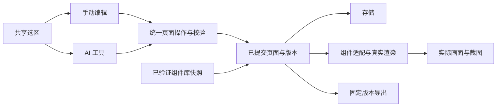

# 架构与关键决策

日期：2026-09-16。状态：共享状态、宿主桥、组件库快照与编辑器设计系统增量已落地；产品范围以 FEATURE_PLAN 为准。

## 模块按变化原因划分

2026-09-16 属性/卡片增量：`card-variants.ts` 仅生成公开配套 props，`assertCardStructure` 在领域提交前检查嵌套字段、唯一 ID、页签引用、头像及互斥状态；继续复用库 Renderer，不生成替代卡片 DOM/CSS。媒体图片可通过文件选择转 data URI 保存到同一页面协议（PNG/JPEG/WebP ≤1 MiB），原生面板不放开外网 CSP。属性标题属于编辑器外层，输入与布尔控件仍为 C-21/C-11。

上下文所有权补充：迟加入实例通过 hello 获取已有时序，claim 使用混合墙钟/逻辑计数，避免旧实例多次 claim 后拒绝新实例接管。启动仍不发布持久选区，不增加页面持久副本。

首版采用一个本地应用内的模块边界，不引入微服务。目录名称是建议，按现有工程调整即可。

| 模块 | 负责什么 | 不应依赖什么 |
|---|---|---|
| 页面领域与操作 | 稳定节点、布局树、属性校验、版本、原子批量操作、历史 | DOM、Codex 宿主、具体存储路径 |
| 组件适配 | 原组件目录、公开属性、默认值、Renderer 生命周期、资源清单 | 编辑器面板状态和具体页面内容 |
| 编辑器 | 组件面板、画布、拖拽、选区、属性、预览 | 绕过页面操作直接改持久化文件 |
| 页面存储 | 按页面保存、加载、格式版本、失败恢复 | UI 事件和组件内部 DOM |
| 导入与导出 | 验证页面描述、固定页面版本、组装资源与可运行工程 | 用户桌面绝对路径、当前画布 DOM 快照 |
| Codex 与工具适配 | 启动入口、页面绑定、AI 查询/操作、截图上下文 | 复制一套页面编辑规则 |

## 必须保持的接口约束

1. 页面数据可序列化；节点标识唯一。布局节点和真实组件节点有明确区别；原组件没有公开插槽时不能任意接收子节点。
2. 写入操作携带明确页面身份与预期版本。先在候选状态校验全部操作，再按已定义的保存语义提交；失效版本或保存失败不能被报告成成功。实现时写清并测试持久化、通知 UI 与历史记录的先后关系。
3. 手动编辑与 AI 使用同一命令处理器。一次批量修改形成一个可撤销单元；撤销和重做也推进版本，不能让旧版本重新成为有效写入依据。
4. 组件属性依据真实公开协议；变体只保留一个权威字段。运行实例、DOM、监听器和临时选区不进入页面持久化结构。
5. 页面删除节点或重绘时正确销毁实例；异步加载返回时检查节点与页面是否仍然有效。避免切页后旧结果覆盖新页面。
6. 导出固定到一个已提交版本；用户继续编辑不改变该次导出内容。资源清单覆盖实际脚本、样式、字体和资源引用。
7. 截图说明 pageId、revision 和 viewport。若无法确认画布已渲染到指定版本，应返回未就绪或失败，不能给旧图标上新版本。
8. 区分 schemaVersion、页面 revision、组件库版本和插件构建版本。前者用于格式迁移，revision 用于并发保护，后两者用于复现渲染和安装结果。

当前协议实现位于 `plugins/page-builder/src/domain.ts` 与 `store.ts`：schemaVersion 为 1，页面与节点使用稳定随机标识；写入携带 pageId 与 expectedRevision；一批 1–100 个操作先在克隆状态中完成校验，再以临时文件 rename 原子保存。每次读写重新读取磁盘事实；写入使用按 pageId 的跨进程独占锁。历史和选区按页面 revision 分代保存，主页面文件最后提交，因此失败写入不会让旧 revision 指向新元数据。历史上限为 100 个批次，撤销/重做继续推进 revision。完整字段以类型与校验代码为权威，本文不复制字段表。

浏览器渲染以 generation 标识淘汰旧异步结果，写入和选区请求分别串行排队；700 ms 轮询只在页面或选区变化时重绘并同步宿主上下文。编辑器标准控件和画布内容都由页面绑定快照中的真实 Renderer 创建；页面 CSS 只负责区域布局、素材条目、树、拖拽和选中框，不覆盖组件内部样式。编辑器语义别名直接引用 B2B Token。

`library.ts` 管理不可变 `b2b-<sha256前缀>` 快照：候选版本先校验真实公开 schema、适配子集、编辑器外壳控件和代表性浏览器渲染，通过后才原子切换“新页面默认版本”。页面保存 libraryId、snapshotId、sourceVersion、digest、adapterVersion；已有页面和导出继续解析原快照，主动升级页面是带 revision 的可撤销操作。内置快照只作离线基线，独立来源由 `component_library_check/apply` 或 HTTP API 传入，不写死本机路径。

宿主 UI 使用 MCP Apps `ui/update-model-context` 发布当前 pageId/nodeId/revision/kind/props，并附宿主支持的 composerLabel；它不会在点击时调用 `ui/message`。独立浏览器、能力缺失、连接失败与同步失败均在界面上区分。工具、HTTP 编辑器和选区共享同一文件事实与锁，而不是各进程缓存副本。

## 决策记录

| 编号 | 决定与状态 | 理由及重新考虑的条件 |
|---|---|---|
| D01 | 用户已授权：首版可视化搭建、AI 协作、导出，并在新任务用 Sol / high 开发 | 不再重复需求确认；高影响范围变化再说明 |
| D02 | 实施默认：沿用原生 HTML/CSS/JS 与真实组件 Renderer | 现有组件库就是该形态，避免维护第二套组件；明确需要其他框架输出时再评估 |
| D03 | 实施默认：先开放 C-02、C-21、C-23、C-42、C-34 基础能力 | 先完成可验收闭环；51 个生产组件不等于51个已适配组件 |
| D04 | 实施默认：布局使用编辑器容器，不扩展 C-34 任意插槽 | 原组件未提供该能力；未来需要时按组件库规则同步修改与验收 |
| D05 | 实施默认：独立运行工程 ZIP + 页面描述导入 | 满足交付和继续开发；任意改写源码的反向导入留到后续 |
| D06 | 工程约束：共享操作协议、版本检查、批量原子性 | 防止 AI 与手动编辑相互覆盖及半完成状态 |
| D07 | 工程约束：本项目维护源码、构建与证据，缓存只读参考 | 当前只找到 v0.1.0 发布包；找到原源码时优先复用，否则记录恢复来源 |
| D08 | 已实施：从发布协议恢复 TypeScript 源码、构建、测试和锁文件；不修改旧 bundle | 有限范围检索未找到原始 src；当前工程可以独立重建并由官方插件校验器检查 |
| D09 | 已实施：只把首批 Renderer 的最小运行闭包 vendoring 到插件 | 保证安装与导出不依赖桌面绝对路径；组件源仍来自 design-source，未修改组件库 |
| D10 | 已实施：旧安装与开发安装使用不同 Marketplace 名 | 原 `page-builder-marketplace` 指向只读 0.1.0 缓存；`page-builder-development` 明确指向正式开发目录，避免伪装更新 |
| D11 | 已实施：页面、历史和选区采用文件事实、revision 分代元数据与跨进程锁 | MCP、独立浏览器和多个任务必须共享状态；内存缓存会允许旧进程覆盖新 revision |
| D12 | 已实施：选区使用 `ui/update-model-context`，不在点击时自动发消息 | 选区应成为下一轮模型上下文；自动 `ui/message` 会擅自触发模型运行 |
| D13 | 已实施：组件库采用候选校验、不可变快照、页面钉住和显式升级 | 组件库可独立更新，同时旧页面、回退与导出仍可复现；协议破坏时拒绝切换 |
| D14 | 已实施：编辑器外壳标准控件使用 C-02/C-04/C-11/C-21/C-23/C-41/C-42/C-49 | 画布和外壳共享真实设计系统协议；页面层只保留编辑器专属布局与关系 |
| D15 | 已实施、原生宿主待验收：自包含 UI + MCP 快照资源/固定工具映射；独立浏览器保留 HTTP | 宿主 CSP 过滤 HTTP localhost，不能将 HTTP 预览当原生证明。离线 transport 适配 loader/core/字体相对基址和 CSS imports，保持 Renderer 语义；资源仅来自验证快照，不暴露任意文件读取。回归在无网络 CSP 下加载真正资源 |

新增重大决策使用 D08 起的编号，记录状态、理由、影响和替代项。常规变量命名、文件移动等不另写决策。

## 仍需目标宿主核实

选区上下文与持久选区分离：持久选区仍由同一 PageStore 保存；引用发布权由每页 BroadcastChannel 有序 claim 协调，启动只清除自身旧引用，显式点击才接管，其他面板清空自己的上下文并停止轮询发布。发布请求按实例串行化、检查epoch，避免晚响应复活旧引用。该协调适用于同源宿主多个页面实例，真实宿主跨实例表现需验收。

- 开发版安装后从 Codex 原生右侧入口实际打开，并与保留的旧版入口清楚区分。
- 原生输入区展示 composer 引用；AI 在同一任务读取该节点并修改后，右侧画布通过共享 revision 自动更新。
- 真实宿主拒绝或超时的用户体验；模拟宿主通过不替代上述操作证据。

## 2026-09-17 决策补充

D16：编辑能力读取页面快照的真实公开 schema，UI/AI/保存校验使用同一版本；静态模块保留编辑器分类与复杂变体转换，不另维护可变的组件枚举。

D17：原生通过通用资源输送执行未改写的库脚本；完整资源采用分段 MCP 读取，运行源码格式变化不再触发补丁失配。候选检查也走相同输送，而不是只在普通 HTTP 浏览器验证。

D18（按用户最新要求修订）：页面固定组件库版本，只提供「刷新并重载组件」。移除定时源库扫描、自动刷新开关/API 和遗留配置；点击时验证当前页再提交版本与历史。其他页和已导出工程不被更新。外部源码、不可变快照和插件安装各自独立。

D19：上下文清除发送 `content: []` 并省略 `structuredContent`；`{pageBuilderSelection:null}` 仍是有效附件，不能用于清除。teardown 和主动重载等待清除完成，发布与清除均使用有界 SDK 请求，失败可重试。测试以宿主附件语义判断空/非空，不以插件自定义字段的真值冒充宿主行为。

D20（修正 D19 的组件重载生命周期）：原生组件库更新在当前文档内释放/重建运行资源，保留 App 连接和 contextOwner，不再关闭选区所有权或调用浏览器导航。仅真正面板 teardown 才关闭所有权。自动发现已保存页面切换快照也复用该路径；有编辑草稿时等待。运行资源替换失败保留原显示并暂停编辑，重试保留服务端新 revision。

## D21 / 属性显示与源值分离（2026-09-18）

属性字段和枚举来自页面绑定的公开 schema；`inspector-options.js` 只翻译显示，不提供允许值、不改变保存格式。常用栏与全部属性共用同一映射，选择器 label 必须反查为对应原值，未知源值保留，重名标签消歧。当前编辑字段布局、中文词典与复杂变体转换仍属于插件适配层；源组件独立更新与编辑器完全元数据化是两个不同的完成边界，详见 COMPONENT_LIBRARY_LIFECYCLE。

## D22 / 源库拥有编辑元数据，插件拥有消费者（2026-09-18）

页面快照同时包含 `builder-contract.json` 与组件实现。插件只解释版本化的纯 JSON，并对照同一快照有效 API 校验字段、控件、条件与枚举；有文件但错误时阻断候选。字段组/中文名/控件/条件随显式重载更新；旧库无文件使用旧适配器。条件控件可选择 union 的合法分支，不能扩展类型；相交的控件/转换规则提前拒绝。全部属性表单支持组合提交与取消，草稿期间阻止重载、切换选区及其他修改。

组件 API 参数只进入 `node.props`；编辑器布局使用既有 LayoutNode/updateLayout；未来包装器设置保留 `node.editor`，不提前实现无使用方字段。简单伴随更新由源 transitions 表达，复杂内容转换仍保留兼容适配器，具体边界与线路契约见 BUILDER_PROTOCOL。源库元数据标签按纯文本处理，不插入未转义 HTML。
