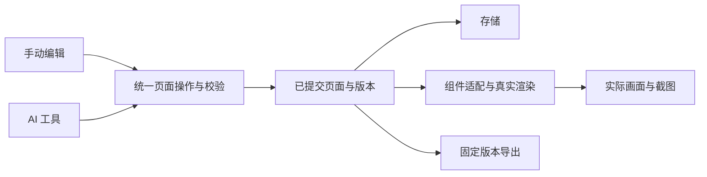

# 架构与关键决策

日期：2026-09-16。状态：首个可运行增量已落地；产品范围以 FEATURE_PLAN 为准。

## 模块按变化原因划分

首版采用一个本地应用内的模块边界，不引入微服务。目录名称是建议，按现有工程调整即可。

| 模块 | 负责什么 | 不应依赖什么 |
|---|---|---|
| 页面领域与操作 | 稳定节点、布局树、属性校验、版本、原子批量操作、历史 | DOM、Codex 宿主、具体存储路径 |
| 组件适配 | 原组件目录、公开属性、默认值、Renderer 生命周期、资源清单 | 编辑器面板状态和具体页面内容 |
| 编辑器 | 组件面板、画布、拖拽、选区、属性、预览 | 绕过页面操作直接改持久化文件 |
| 页面存储 | 按页面保存、加载、格式版本、失败恢复 | UI 事件和组件内部 DOM |
| 导入与导出 | 验证页面描述、固定页面版本、组装资源与可运行工程 | 用户桌面绝对路径、当前画布 DOM 快照 |
| Codex 与工具适配 | 启动入口、页面绑定、AI 查询/操作、截图上下文 | 复制一套页面编辑规则 |

## 必须保持的接口约束

1. 页面数据可序列化；节点标识唯一。布局节点和真实组件节点有明确区别；原组件没有公开插槽时不能任意接收子节点。
2. 写入操作携带明确页面身份与预期版本。先在候选状态校验全部操作，再按已定义的保存语义提交；失效版本或保存失败不能被报告成成功。实现时写清并测试持久化、通知 UI 与历史记录的先后关系。
3. 手动编辑与 AI 使用同一命令处理器。一次批量修改形成一个可撤销单元；撤销和重做也推进版本，不能让旧版本重新成为有效写入依据。
4. 组件属性依据真实公开协议；变体只保留一个权威字段。运行实例、DOM、监听器和临时选区不进入页面持久化结构。
5. 页面删除节点或重绘时正确销毁实例；异步加载返回时检查节点与页面是否仍然有效。避免切页后旧结果覆盖新页面。
6. 导出固定到一个已提交版本；用户继续编辑不改变该次导出内容。资源清单覆盖实际脚本、样式、字体和资源引用。
7. 截图说明 pageId、revision 和 viewport。若无法确认画布已渲染到指定版本，应返回未就绪或失败，不能给旧图标上新版本。
8. 区分 schemaVersion、页面 revision、组件库版本和插件构建版本。前者用于格式迁移，revision 用于并发保护，后两者用于复现渲染和安装结果。

当前协议实现位于 `plugins/page-builder/src/domain.ts` 与 `store.ts`：schemaVersion 为 1，页面与节点使用稳定随机标识；写入携带 pageId 与 expectedRevision；一批 1–100 个操作先在克隆状态中完成校验，再以临时文件 rename 原子保存，成功后才替换内存状态。历史上限为 100 个批次，撤销/重做继续推进 revision。完整字段以类型与校验代码为权威，本文不复制字段表。

浏览器渲染以 generation 标识淘汰旧异步结果，写入请求在 UI 层串行排队；这两层分别避免旧 Renderer 追加到新画布、以及快速连续操作基于同一 revision 竞争。编辑器 Token 使用 `--pb-*` 命名空间，避免真实组件全局 Token 覆盖编辑器 chrome。

## 决策记录

| 编号 | 决定与状态 | 理由及重新考虑的条件 |
|---|---|---|
| D01 | 用户已授权：首版可视化搭建、AI 协作、导出，并在新任务用 Sol / high 开发 | 不再重复需求确认；高影响范围变化再说明 |
| D02 | 实施默认：沿用原生 HTML/CSS/JS 与真实组件 Renderer | 现有组件库就是该形态，避免维护第二套组件；明确需要其他框架输出时再评估 |
| D03 | 实施默认：先开放 C-02、C-21、C-23、C-42、C-34 基础能力 | 先完成可验收闭环；51 个生产组件不等于51个已适配组件 |
| D04 | 实施默认：布局使用编辑器容器，不扩展 C-34 任意插槽 | 原组件未提供该能力；未来需要时按组件库规则同步修改与验收 |
| D05 | 实施默认：独立运行工程 ZIP + 页面描述导入 | 满足交付和继续开发；任意改写源码的反向导入留到后续 |
| D06 | 工程约束：共享操作协议、版本检查、批量原子性 | 防止 AI 与手动编辑相互覆盖及半完成状态 |
| D07 | 工程约束：本项目维护源码、构建与证据，缓存只读参考 | 当前只找到 v0.1.0 发布包；找到原源码时优先复用，否则记录恢复来源 |
| D08 | 已实施：从发布协议恢复 TypeScript 源码、构建、测试和锁文件；不修改旧 bundle | 有限范围检索未找到原始 src；当前工程可以独立重建并由官方插件校验器检查 |
| D09 | 已实施：只把首批 Renderer 的最小运行闭包 vendoring 到插件 | 保证安装与导出不依赖桌面绝对路径；组件源仍来自 design-source，未修改组件库 |
| D10 | 已实施：旧安装与开发安装使用不同 Marketplace 名 | 原 `page-builder-marketplace` 指向只读 0.1.0 缓存；`page-builder-development` 明确指向正式开发目录，避免伪装更新 |

新增重大决策使用 D08 起的编号，记录状态、理由、影响和替代项。常规变量命名、文件移动等不另写决策。

## 首次实施需要核实

- 原始源码未找到；已恢复可复现构建并保留发布基线事实。
- 首批组件加载采用真实 Loader/Renderer 与最小资源闭包；组件 Token 与编辑器 Token 已通过命名空间隔离。
- 目标 Codex 版本支持的入口、安装更新方式、工具与当前页面绑定机制；不能假定工具自动携带任务身份。
- AI 截图的实际可用通道；需要绑定到真实页面而非模拟页面。
- 旧 mock 页面如何识别、备份、迁移或明确拒绝；不得覆盖用户已有保存数据。
