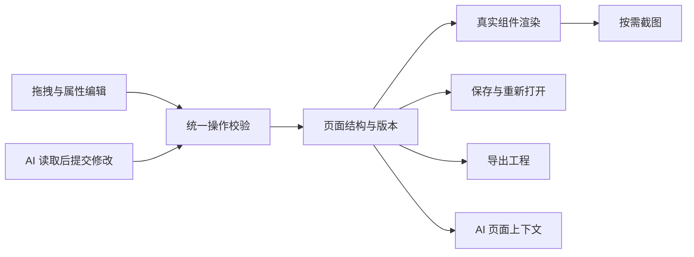

# Codex 页面搭建器：功能方案 v0.1

2026-09-16 补充：同一页面多个编辑器实例只允许当前操作面板发布选区上下文；属性枚举以页面绑定组件库 describe 为准。C-21 六种变体已适配；其他复杂变体未适配时必须显示真实名称与灰显说明。编辑器宽高随宿主可用空间变化，画布和属性面板内部滚动，不以固定最小页面尺寸撑大宿主。

日期：2026-09-16  
状态：用户已授权以此为基础开发首版；方案中的具体技术默认值由开发任务核实并记录，实际进度见 PROGRESS.md。  
基础：桌面项目 `ai-design-system` 与当前已安装的 Page Builder 插件。

## 1. 产品定义

在 Codex 的右侧工作区中，使用现有设计系统搭建页面。用户可以拖拽、调整排列、编辑内容、切换变体和删除组件；AI 可以读取同一页面及当前选区，继续生成或修改；完成后导出可运行、可继续开发的页面工程。

目标使用者包括不懂开发的产品、设计和业务人员，以及需要快速搭建标准页面的开发者。默认面向现有组件库适合的 B2B 页面。

核心体验：打开页面 → 手动搭建或让 AI 生成 → 选中局部修改 → 预览交互 → 导出 → 继续开发。

## 2. 用户已提出的需求

| 编号 | 需求 | 方案中的具体含义 |
|---|---|---|
| U1 | 可以安装在 Codex 中 | 交付可安装插件及所需资源，支持在目标 Codex 桌面环境中启动 |
| U2 | 在右侧可视化搭建 | 对话与编辑器可以同时使用；右侧呈现真实页面画布 |
| U3 | 拖拽组件生成页面 | 从组件库新增实例，调整已有实例的位置和顺序 |
| U4 | 修改文字与变体 | 通过属性面板或支持的行内编辑修改组件公开内容；切换合法变体 |
| U5 | 删除已有组件 | 删除选中实例，保留撤销恢复能力 |
| U6 | AI 看见页面或插件内容 | AI 可读取组件目录、页面结构、选区、属性、版本；按需取得实际渲染截图 |
| U7 | AI 在现有页面上阅读或开发 | AI 可解释页面、局部修改、增加组件，也可基于导出工程补充业务逻辑 |
| U8 | 一键导出 | 一次操作导出页面源码、组件依赖、资源和可再次编辑的页面描述 |
| U9 | 组件库与插件解耦，组件库可以单独更新 | 兼容更新无需重新构建/安装插件；页面绑定明确组件版本，更新可校验与回退，导出携带固定版本资源。详见 [组件库独立更新](COMPONENT_LIBRARY_LIFECYCLE.md) |
| U10 | 搭建器页面自身也使用组件库与整体设计规范 | 工具栏、页签、搜索、属性编辑和反馈使用真实 Renderer；页面壳复用设计系统 Token/布局，保留编辑器专属行为。详见 [搭建器自身使用设计系统](EDITOR_DESIGN_SYSTEM.md) |

以下的布局方式、导出格式、组件分批顺序和暂缓范围属于建议默认值，尚不视为用户已确定的产品决策。

## 3. 页面与组件的编辑边界

2026-09-16 补充：所有属性控件提供持久可见的语义标题，不能只依赖占位文字。C-21 长文本默认使用库的固定高度，自动增高由显式开关控制；C-34 十种公开变体接入配套头像、子卡片、页签和操作数据，媒体变体先配置图片。切换不兼容专属配置前显示重置/撤销提示。

每个有独立使用意义的页面元素都可以成为可选、可移动的节点，但需要区分三个层级：

| 层级 | 示例 | 编辑方式 |
|---|---|---|
| 页面布局 | 页面区块、横排、纵排、分栏 | 调整顺序、列比例、对齐、外部间距，接收组件 |
| 独立组件 | 按钮、输入框、选择器、卡片、表格 | 拖入、移动、复制、删除，修改公开属性和变体 |
| 组件内部内容 | 按钮文案、表格列、菜单项、卡片标题 | 通过父组件属性或结构化子项编辑；仅在公开插槽允许时接收独立组件 |

例如，按钮的文案可直接修改；按钮内部图标位置由它的公开能力决定。表格可编辑列和行，表格内部状态标签通常由表格统一管理。

现有 C-34 卡片未开放任意子组件插槽，不能直接承诺将任意按钮或表格拖进卡片正文。首版使用页面布局容器组合组件；后续若开放组件插槽，必须同步完善原组件协议和验证。C-41 Tabs 接受的 DOM 内容也需要转换为可保存的子节点描述，不能把 DOM 对象直接写入页面文件。

组件的颜色、字体、内部间距等沿用设计系统；属性面板只开放组件协议允许的选项。独立标题、正文、图片等基础内容块需要单独登记适配能力，不能因浏览器支持相应元素就默认它们已经存在于当前组件清单。

## 4. 首版功能范围

| 模块 | 首版能力 | 关键规则 |
|---|---|---|
| 插件启动 | 安装、打开右侧编辑器、恢复已保存页面 | 实际安装和点击入口必须在目标 Codex 版本验收 |
| 页面文件 | 新建空白页面、命名、保存、打开、导入自身工程 | 页面独立保存；当前任务明确绑定当前页面 |
| 组件面板 | 分类、中文名称、搜索、预览、拖拽添加 | 显示组件可用状态，只允许插入已经适配的能力 |
| 画布 | 选中、拖入、拖动排序、移动到合法布局容器、复制、删除 | 拖拽显示插入位置；非法落点不能提交 |
| 页面结构 | 层级列表、定位组件、查看父子关系 | 与可添加组件库分别展示，避免混淆 |
| 布局 | 纵向流式排列、横排、基础分栏、对齐和外部间距 | 使用设计系统允许的布局规则；首版不采用任意坐标定位 |
| 内容编辑 | 文本字段、单行或多行编辑，必要的列表子项编辑 | 仅编辑真实公开属性，校验后提交 |
| 变体编辑 | 切换合法变体和尺寸，展示适用选项 | 保留兼容内容；不能直接转换时解释原因，不静默丢弃数据 |
| 编辑恢复 | 自动保存、保存状态、撤销、重做 | 手动编辑和 AI 修改都进入操作历史；失败不留下半完成页面 |
| 预览 | 编辑/预览模式切换，桌面与窄屏检查 | 编辑时避免触发业务动作；预览时允许组件原有交互 |
| AI 读取 | 当前页面、选区、组件能力、最近改动、按需画面 | 结构读取与截图读取分别提供；截图标注页面版本和视口 |
| AI 修改 | 添加、移动、更新内容、切换变体、删除，支持一批操作 | 使用与手动编辑相同的校验和保存通道 |
| 一键导出 | 输出完整页面工程包 | 导出已提交版本，附源码、组件资源和页面描述 |

原有 51 个生产组件是目标接入范围，不等同于 51 个组件都已完成编辑器适配。组件能力需分批验证后开放。

## 5. 编辑器界面安排

Codex 对话区继续负责自然语言输入；右侧插件包含以下区域：

| 区域 | 内容 |
|---|---|
| 顶部 | 页面名称、保存状态、撤销/重做、视口选择、预览、导出 |
| 左侧可折叠面板 | “组件”与“页面结构”两个标签 |
| 中间 | 页面画布、选中框、拖拽落点、局部操作 |
| 属性面板 | 选中节点的内容、变体、状态或布局选项 |

右侧工作区较窄时，组件面板与属性面板使用抽屉或切换面板，保留画布的可用宽度。需要精细编辑时提供宿主允许的扩大工作区入口。

用户选中组件并点击「加入 AI 上下文」后，可直接在 Codex 中说“把这个按钮改成提交申请”“把这个区域改成两列”。界面显示当前 AI 操作对象，防止用户误以为改的是另一区域。

## 6. AI 协作方式

“AI 看见”拆成两种能力：

- 理解页面：读取页面结构、组件编号、属性、父子关系、选区和已提交版本。它决定 AI 能准确操作哪个对象。
- 观察画面：按需读取实际渲染截图，检查溢出、遮挡、留白和窄屏布局。截图只描述对应版本的视觉结果。

插件 UI 可通过 MCP Apps 的模型上下文机制传递选区摘要；AI 也必须能够主动读取最新页面。界面展示出来并不代表模型自动获得所有内容。官方文档明确区分了模型可见的工具结果和仅供 UI 使用的元数据。[工具结果说明](https://developers.openai.com/plugins/reference)；[UI 与模型上下文](https://developers.openai.com/plugins/build/chatgpt-ui)。

AI 操作顺序：读取当前页面与版本 → 读取目标组件能力 → 提交结构化变更 → 校验并保存 → 更新画布 → 返回改动结果。

建议的工具能力分为四组，具体名称在实现时确定：

| 工具组 | 能力 |
|---|---|
| 组件查询 | 列出可用组件，读取属性、变体、事件和适配状态 |
| 页面读取 | 读取页面、指定子树、当前选区、最近改动和渲染截图 |
| 页面操作 | 新增、移动、删除、更新属性、批量操作、撤销与重做 |
| 工程交付 | 校验页面、导出、读取导出路径与依赖说明 |

首版默认采用明确的版本校验。过期写入返回冲突信息，由 AI 重新读取；整批变更通过后才一起提交。不能以旧页面覆盖用户刚刚完成的拖拽。

同一个项目的不同页面、不同任务之间要有明确标识。不能沿用当前全局单一示例页面，让另一任务误改当前页面。

## 7. 一键导出的定义

建议首版导出 ZIP 工程包，目标是“离开搭建器也能运行，并能交给开发者继续开发”。组件库目前为原生 HTML/CSS/JavaScript，首版沿用该技术形态。

| 导出内容 | 用途 |
|---|---|
| 页面入口与布局样式 | 在浏览器中呈现页面 |
| 页面渲染脚本 | 根据页面描述调用真实组件渲染接口 |
| 页面描述文件 | 保留组件、内容、排列、变体、页面版本，可重新导入编辑器 |
| 固定版本的组件运行资源 | 所需脚本、样式、字体、图标及其他依赖 |
| 本地引用的业务资源 | 保证移出原机器目录后仍可加载；远程资源依赖需要列明 |
| 独立业务逻辑入口 | 供开发者或 Codex 监听公开事件并接入真实数据 |
| 运行说明与依赖清单 | 说明如何本地启动、组件版本和待实现的业务行为 |

导出前等待当前编辑提交完成，并固定到一个明确页面版本。默认采用版本化输出目录，避免覆盖之前导出的成果。导出应经过资源完整性检查，不能依赖用户桌面上的绝对路径。

“可运行”以附带的本地启动方式为验收依据；是否能双击 HTML 直接运行需另行验证。导出时优先保证依赖完整，后续再优化资源体积。

拖拽生成的是页面结构与组件交互。数据查询、提交到服务器、登录、权限等业务逻辑可以由 AI 基于导出工程继续开发。首版不承诺这些逻辑自动具备。

编辑器可以重新导入自身页面描述。开发者在导出源码中任意修改代码后，不保证这些变化都能自动反向恢复到可视化编辑器。应将自定义业务代码与生成文件分开；后续覆盖生成文件时仍需保留或明确提示差异。

## 8. 统一数据原则

手动编辑、AI 修改、画布展示、保存和导出都使用同一份已提交页面描述。

页面描述保存稳定节点标识、组件版本、公开属性、布局和合法子节点；选择状态可以另行维护，但必须能被 AI 查询。截图不是持久化真相；DOM 也不用于反推完整工程。

首版复用原组件 Renderer，避免产生第二套外观相似的组件。变体只保留一个权威字段，减少节点元信息与 props 互相矛盾的可能。组件内部 DOM、事件、键盘与焦点行为继续归组件所有；编辑器模式仅在协议声明的文字区域临时开启原位输入，关闭恢复，预览不接管。

## 9. 方案准备阶段的基础与缺口

以下为方案准备阶段的历史事实，不代表当前实现状态；当前状态见 PROGRESS 与 ACCEPTANCE。

| 已有基础 | 需要补齐 |
|---|---|
| 组件库有 51 个生产组件协议；静态检查 51/51 通过 | 每个组件的编辑器元数据、适用默认内容、属性编辑方式与接入验收 |
| 统一组件加载、描述、渲染、更新和销毁接口 | 搭建器真实渲染桥接、脚本/样式/字体资源加载与隔离 |
| 插件可以返回 Page Schema 和当前选区 | 组件目录查询、结构操作、截图与导出工具 |
| 已有页面保存、文字修改与版本冲突检查 | 页面隔离、结构变更事务、撤销/重做、批量操作与导入 |
| 已有编辑器 UI | 左侧组件素材库、通用画布、拖拽及完整属性面板 |

运行中的工具返回页面版本 18、4 个组件节点、`mock-b2b` 提供方，说明结构读取链路存在，真实组件库尚未接入。当前左侧主要是已有节点列表，画布使用模拟预览。

真实 C-40 表格参数与当前模拟数据不一致，需要迁移；C-34 卡片没有任意子节点插槽；C-41 的 DOM 内容需要单独处理保存和恢复。这些问题必须在组件适配阶段落实。

安装包包含插件入口、工具服务、UI 和资源。官方插件文档提供了打包结构说明，但当前机器上“右侧原生入口点击后是否正确显示”仍需实际验收；现有元数据或模拟测试不能替代这一步。[插件打包说明](https://developers.openai.com/plugins/build/plugins)。

## 10. 开发顺序建议

| 阶段 | 内容 | 完成标准 |
|---|---|---|
| A：真实组件与页面基础 | 接通真实组件库、页面布局和保存；先接按钮、输入框、选择器、标签、基础卡片 | 加载真实样式与交互；重复添加多个同类组件；保存后恢复一致 |
| B：可视化编辑 | 拖入、排序、合法容器移动、文字、变体、复制删除、撤销重做 | 用户独立完成一个页面；所有改动进入页面结构 |
| C：AI 协作 | 查询、选区、局部与批量操作、版本冲突、截图 | AI 可以基于用户刚完成的编辑继续修改，不覆盖新内容 |
| D：导出与安装交付 | 工程导出、重新导入、资源打包、目标 Codex 安装与右侧入口测试 | 在独立目录运行导出页面；重新导入保持结构；目标宿主可用 |
| E：组件覆盖扩展 | 表格、复杂表单、图表、导航、弹层等逐批适配 | 每个开放组件通过内容、变体、交互、保存、导出验证 |

A—D 构成可用首版的完整流程；E 按组件需求扩展覆盖。以上是依赖顺序，不是工期承诺。需在确认源码位置、宿主入口和实际集成后再估算工作量。

## 11. 首版验收场景

1. 安装插件，在目标 Codex 桌面环境中打开右侧编辑器，对话区与画布可以同时使用。
2. 新建页面，拖入分栏、输入框、两个按钮和卡片；两个同类组件分别具有独立内容和标识。
3. 移动组件到另一合法容器，页面、结构列表和保存数据一致；非法落点不改变页面。
4. 修改按钮文字与合法变体；无效组合不被保存，原有内容不静默消失。
5. 删除组件后撤销，内容、位置和父子关系恢复；重做结果一致。
6. 在输入文字时按删除键仅编辑文本，不误删整个组件；通过属性面板或排序按钮也能完成关键操作。
7. 关闭再打开页面，结构、内容和变体保持；另一个任务不会默认操作同一页面。
8. 选中按钮并加入 AI 上下文后让 AI 修改“这个按钮”，AI 读取到正确节点；用户在 AI 工作期间修改同一页面时不会被旧数据覆盖。
9. AI 批量调整布局时，成功则整批生效，失败则保留完整原页面；可撤销这次 AI 修改。
10. 预览模式可以使用组件本身的交互；编辑模式可以稳定选择组件，不误触发业务操作。
11. 导出页面在独立目录按说明启动，样式和组件资源完整；不依赖本机组件库绝对路径。
12. 将导出工程中的页面描述重新导入，支持范围内的结构、文字和变体保持一致。
13. AI 获取的截图对应指定页面、视口和版本；截图失败时不能宣称完成视觉检查。

## 12. 建议后续范围

首版之后再考虑任意组件插槽、像素级自由布局、框架代码生成、任意外部网页或源码反向导入、多页面路由、数据源与事件流程可视化配置、在线多人编辑和云发布。

以上功能可以独立扩展。当前优先目标是让手动搭建、AI 修改、保存和导出成为一条可靠的完整流程。

## 13. 本地核对依据

- [组件库说明](/Users/wangkewei/Desktop/ai-design-system/README.md)
- [组件运行接口](/Users/wangkewei/Desktop/ai-design-system/design-source/components/runtime/README.md)
- [组件参数定义](/Users/wangkewei/Desktop/ai-design-system/design-source/components/runtime/api-schema.js)
- [组件使用与开发边界](/Users/wangkewei/Desktop/ai-design-system/AGENTS.md)
- [当前插件画布实现](/Users/wangkewei/.codex/plugins/cache/page-builder-marketplace/page-builder/0.1.0+codex.20260907025217/dist/ui/index.html:334)
- [当前插件服务与页面存储](/Users/wangkewei/.codex/plugins/cache/page-builder-marketplace/page-builder/0.1.0+codex.20260907025217/dist/server.js:21162)
- 运行时只读核对：`page_get_schema`、`page_get_selection`；未修改当前页面。

以上事实来自方案准备阶段，当时未修改组件库、插件代码或同步参考资料。后续实现与验收见 PROGRESS.md 和 ACCEPTANCE.md；静态协议检查不代表全组件浏览器接入验证已完成。

## 2026-09-17 范围更新

当前五个组件补齐公开属性入口与全部 37 种变体；标签额外覆盖四种类型。组件库增加独立源目录和「刷新并重载组件」按钮。按用户最新要求，取消自动检查和自动刷新，只有显式点击才更新当前页。其余组件尚未直接开放为可编辑；新增组件/复杂新变体仍需要适配和浏览器验收。完整组件库资源可更新，与左侧已适配组件数不是同一概念。

## 2026-09-18 编辑协议范围

用户授权两端分别开发：插件解释编辑协议，ai-design-system 新任务维护独立元数据文件。首批五组件的字段分组、中文标签/选项、控件、显示/启用条件和简单伴随更新从源文件读取，手动刷新生效。复杂变体的内容迁移仍属于兼容适配范围，不能声称任意新变体已自动接入。组件设置与插件布局设置使用独立数据边界，协议不改组件 CSS 或 Renderer。

## 拖拽落点与让位反馈（2026-09-21）

- 拖入前显示带组件名称、目标容器和序号的蓝色占位；支持开头、中间、末尾、空容器与画布空白处。
- 已有组件随占位移动平滑让位；纵向、换行横向、分栏和嵌套容器共用落点规则，已有节点可拖动排序或移入/移出容器。
- 长页面靠近画布上下边缘滚动，取消后立即停止；系统开启减少动态效果时关闭动画。
- 拖动不保存临时状态，松手只提交一次；Esc、画布外松手、原位放回不产生页面修改。保存失败或版本冲突保留已保存内容，支持再次拖动。
- 沿用点击添加、上移/下移作为非拖拽操作。此次仅实现桌面鼠标/触控板的 HTML 拖拽，未增加手机触摸拖动。

## 选区工具栏、明确引用与局部更新（2026-09-21）

- 非根节点选中后显示上移/下移、复制、删除；布局复制包含完整子树，撤销重做沿用页面协议。浮动工具栏使用源 C-02/C-04，适应滚动与窄面板。
- 选中仅编辑；「加入 AI 上下文」显式建立引用。换选和调整排列不替换引用对象，已引用对象的最新已保存内容继续同步，删除后清除。源库仍仅手动刷新。
- 新增只挂载新增实例，移动复用实例，属性变化只替换目标实例；页面名称和属性面板无关变化不重复挂载。
- 编辑器 Foundation、图标和标准控件来自同一源快照；编辑器专用画布/占位/选框仅组合布局与源 Token，不改变组件内部样式。

## 多组件上下文（2026-09-21）

- 画布和结构树支持 ⌘ / Ctrl + 点击切换多选；结构树支持带修饰键的 Enter/空格。普通点击恢复单选，属性区多选时显示列表，避免误将单节点操作当成批量修改。
- 「加入 AI 上下文（N）」将这些节点合并成一个附件；换选不替换引用，目标内容保存后同步，删除部分保留其他引用，全部删除才清空。失败重试沿用失败时的引用组。
- 此次不增加框选、批量属性编辑或批量拖动；多选仅为当前面板会话状态。控件、数量标签和图标继续使用组件库。

## 空白取消选择与页面信息（2026-09-21）

点击画布留白、根布局间隙或画布外侧空白清除单选/多选，保留 AI 引用。未选中时显示页面名称、组件数量、布局数量和编辑提示；页面名仍在顶部编辑。「页面布局」进入现有根布局的方向/间距设置，子布局仍可单独选择。预览、拖动和未应用的属性草稿沿用现有保护。

## 2026-09-22 / 画布内容编辑

内容字段支持单击选择、双击后光标进入原来的组件文字，保持原字体/颜色/位置，无独立弹窗；右侧保留变体/外观/复杂设置，按公开属性路径去重。首批为顶层文字与输入数值；图标选择器和子列表画布编辑另行迭代。范围、交互、兼容与源控件限制见 [画布内容编辑](INLINE_EDITING.md)。
